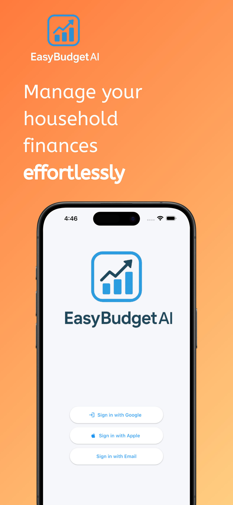
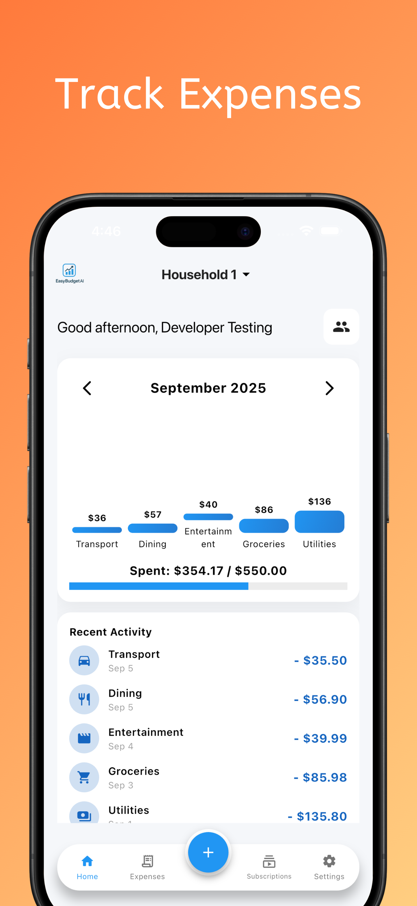
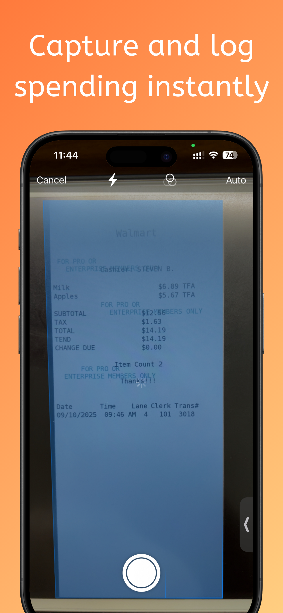
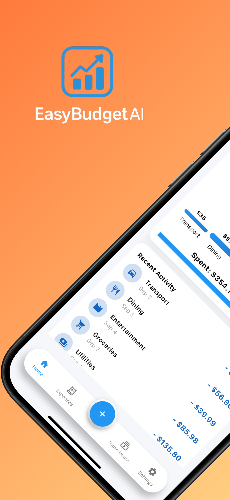
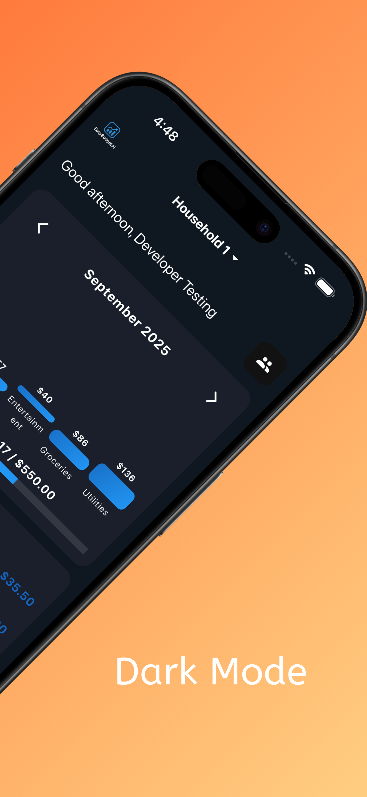
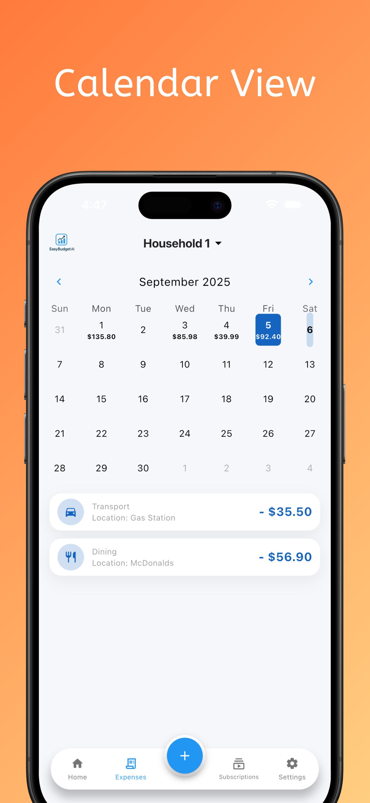
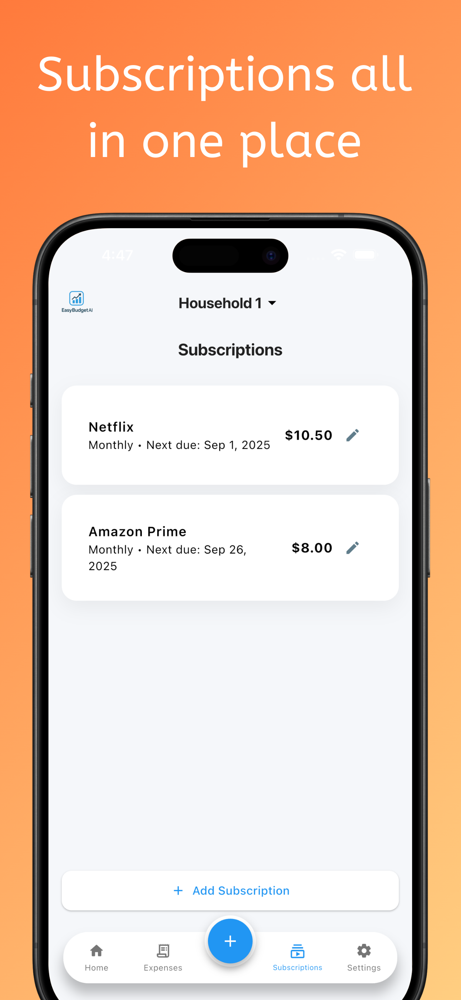

# EasyBudgetAI 💸

**Manage Your Household Finances Effortlessly!**

Take control of your household spending with **EasyBudgetAI** – the all-in-one app for managing households, tracking expenses, and staying on top of subscriptions. Whether you’re living with family, roommates, or running a small shared budget, our app makes money management simple, visual, and even fun!  

---

## 🚀 Features

- 🏡 **Household Management**  
  Create or join households with a secure PIN and join ID. Easily manage members and switch between households in seconds.

- 💰 **Expense Tracking**  
  Log your expenses in seconds, categorize them, and see who paid what. Perfect for roommates, families, or shared budgets.

- 📸 **Automatic Receipt Capture**  
  Snap a photo of your receipt and let the app automatically add it to your expenses – saving you time and keeping everything accurate.

- 📊 **Interactive Charts & Tables**  
  Visualize your spending with dynamic charts and tables. Track budgets, spot trends, and make smarter financial decisions.

- 🔔 **Subscription Management**  
  Keep tabs on recurring payments and subscriptions, so nothing slips through the cracks.

- 🔒 **Secure & Personal**  
  Your data is safe, and you control what’s shared. Everyone sees what they need, nothing more.

---

## 📱 Screenshots

  
  
  
  
  
  
  

---

## 📥 Download

👉 [**Get EasyBudgetAI on the App Store**](https://apps.apple.com/ca/app/easybudgetai/id6751494852)  

---

## 💡 About

Whether it’s monthly bills, groceries, or shared subscriptions, **EasyBudgetAI** helps you stay organized, save time, and make smarter financial choices.  

Download now and take control of your household finances – one expense at a time!  
